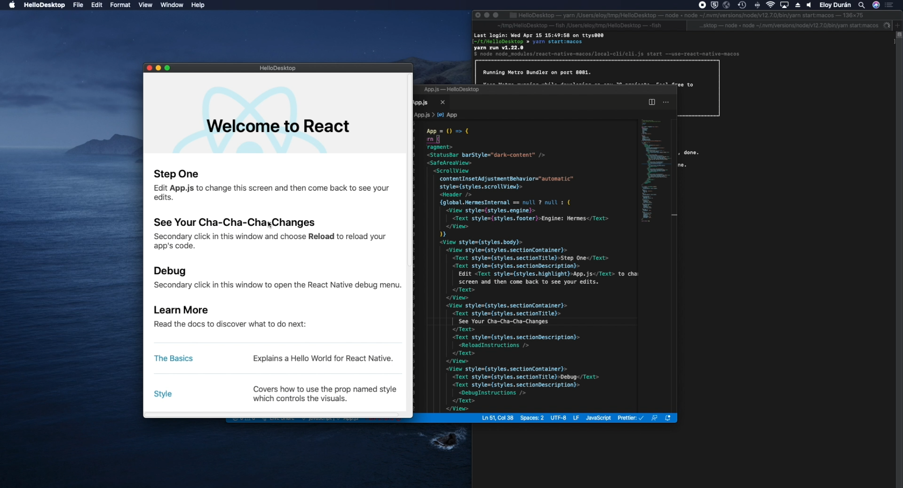
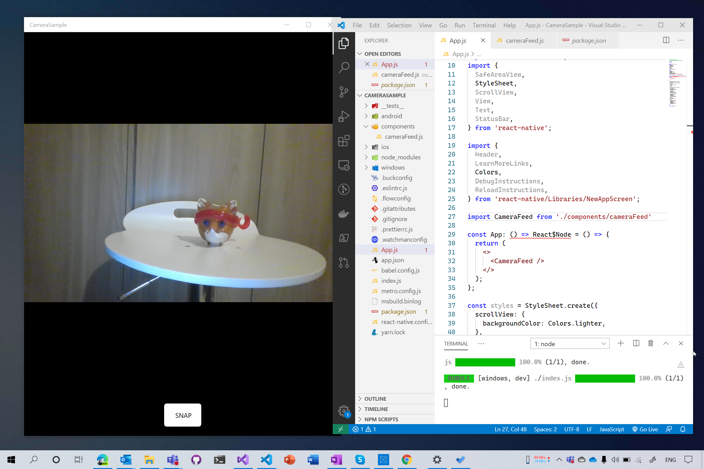
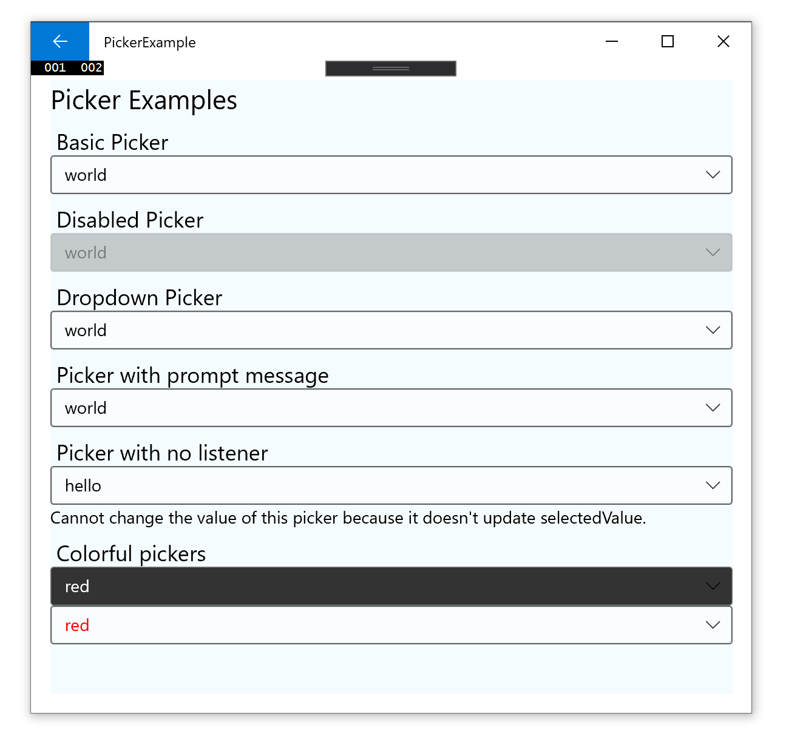
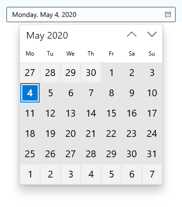

We're excited to announce our first preview release aligning with [React Native 0.62](https://reactnative.dev/blog/2020/03/26/version-0.62)!

As a preview release, we will try our best not to make breaking changes, but still have a few bumps to sort out before we're ready for release. You can now start trying out the [0.62-preview of React Native for Windows](https://www.npmjs.com/package/react-native-windows/v/0.62.0-preview.6)!

A similar upgrade for [React Native for macOS is in progress](https://github.com/facebook/react-native/compare/master...microsoft:fb62merge). Stay tuned for the next update!

## What's New?

- New Features from React Native 0.62, like [`Appearance`](https://reactnative.dev/docs/appearance) and [`useColorScheme()`](https://reactnative.dev/docs/usecolorscheme) hooks
- Visual Studio V142 build tools are now used
- Better RTL support
- New native module APIs (`REACT_INIT` and `REACT_FUNCTION`)
- Improved diagnostics in command line tools
- Initial ARM64 support
- Experimental support for binary distribution of React Native Windows
- Bug fixes and reliability improvements

## React Native for macOS

One of our biggest announcements recently is our addition and full support of the [React Native for macOS](https://microsoft.github.io/react-native-windows/docs/rnm-getting-started) extension! We are super excited to be developing React Native support for macOS along side our Windows effort.

We have an official [npm package out for React Native for macOS](https://www.npmjs.com/package/react-native-macos) and a [repo available](https://github.com/microsoft/react-native-macos) to the public to follow and contribute to - we hope to see some really cool React Native apps out there in the future that can now truly run everywhere.

## React Native on the Surface Duo

React Native runs on the Surface Duo!

This is a little bit to be expected, as React Native works great today with Android, but just running on the new Surface Duo device isn't enough. We've also added support for awareness of the dual-screen device and its status through shipping two important APIs: **TwoPaneView** and **DeviceInfoModule**.

To learn more about developing on the Surface Duo with React Native, [go check out our latest blog post](https://devblogs.microsoft.com/surface-duo/build-react-native-apps-for-microsoft-surface-duo/) detailing the experience.

## New Modules Supported!

We've begun addressing the Windows community module support gap - starting with contributions from us! This includes [**WebView**](https://github.com/react-native-community/react-native-webview) and [**Camera**](https://github.com/react-native-community/react-native-camera), [Picker](https://github.com/react-native-community/react-native-picker), [AsyncStorage](https://github.com/react-native-community/async-storage), [NetInfo](https://github.com/react-native-community/react-native-netinfo), and [DateTimePicker](https://github.com/react-native-community/datetimepicker).

On top of that initial set, we're also looking at a whole bunch more that we know are awesome and essential to have when building a React Native app. Check out the full list of what we're tracking and planning to tackle next on our [GitHub Project Board](https://github.com/microsoft/react-native-windows/projects/23).

Lastly, in addition to contributing to these community modules personally, we want to help bootstrap a robust test infrastructure and enhance reliability for consumers of these modules. We have started this process by adding CI to `react-native-webview` repo. Stay tuned for more!

### WebView

The WebView module sets you up with the barebones web hosting tech that's available nativly on the device you're targetting. This module has been updated to support Windows and macOS.

> To get your own version of the app in this short clip, check out the [RssReader sample](https://github.com/microsoft/react-native-windows-samples/tree/main/samples/rssreader).

### Camera

The Camera module is another big step towards making it easier to give you unfettered access to native APIs.

Just like on mobile, when you define a CameraFeed module, and the device you're running the app on has a camera attached, the component will hookup to the correct native APIs to give you access to the hardware needed to snap sweet pics.

### Picker

### AsyncStorage

Arguably one of the most important modules to have available to you when building a React Native app, AsyncStorage is now fully supported on Windows and macOS.

### NetInfo

An important network API for hooking up to and checking the health of your connection. As React Native is a JavaScript-based framework the need for an API such as this to be readily available on all platforms is very valuable - our recent release for this module supports both Windows and macOS.

### DateTimePicker

A unique component that in many ways defines the design of the platform you're using, the DateTimePicker community control has been updated to support Windows as well now.
