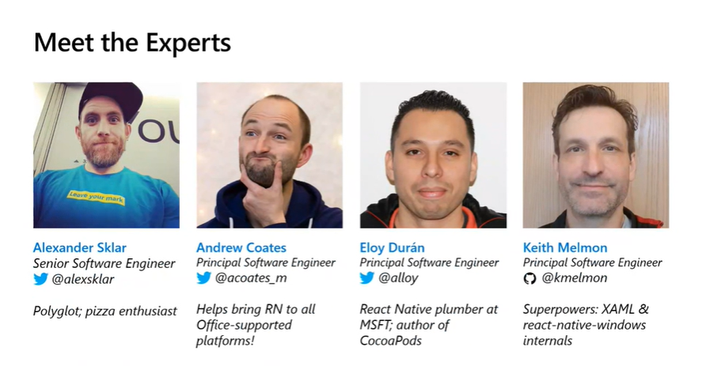
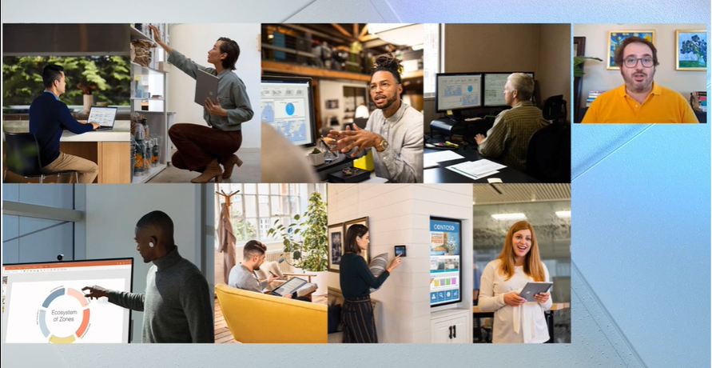

At the end of May 2020, Microsoft wrapped up the annual [Build developer conference](https://mybuild.microsoft.com/). React Native was a big theme at Build 2020 this year, with over 6 sessions dedicated to React Native and many tie-ins from other talks.

The biggest announcement from the team is that React Native for macOS is ready for general consumption! Although we announced this on [our blog](2020-05-19-rn4mupdadates.md) a few weeks ago, the team spent more time deep-diving into how folks can get started building apps for Windows and macOS.

We also announced several 1st and 3rd party applications that are taking advantage of React Native. For example, we showed how the Xbox (Beta) app for PC uses React Native for Windows to create great native experiences for gamers. Additionally, we announced that Facebook was using React Native for Windows and macOS to build Messenger Desktop.

## Key Takeaways

The team held 2 focus groups focused on cross-platform native app development, where the main goal was to understand motivotors, invesments, and challenges that people developing cross-platform applications faced. Below are some key takeaways from these focus groups and Q&A sessions:

- Cross-platform developers are looking to share as much code as possible between mobile and desktop apps; however, developers do differentiate between mobile (iOS, Android) and desktop (Windows, macOS, Linux).

- React Native continues to gain momentum and is seen as a viable stack due to familiaritiy with React and industry investment; this interest has become so prevalent that **enterprise companies are requesting solutions built with React Native by name.**

- **Linux was a common target platform** for developers that are looking to target desktop.

- Compared to Electron, native-based platforms like React Native were perceived favorably mainly **due to better performance.**

- **Developers and designers prefer native apps**; platforms like Flutter are gaining in populatority, but not being native is seen as a negative.

## Sessions

### Skilling Session - "Build cross platform apps that target Windows, Mac, and more!"

React Native isn't just for building mobile apps! Come learn how you can use React Native to build truly native applications that target the entire family of Windows devices, Android, iOS, and Mac!

View the session on [YouTube](https://www.youtube.com/watch?v=QMFbrHZnvvw).

<iframe width="560" height="315" src="https://www.youtube.com/embed/QMFbrHZnvvw" frameborder="0" allow="accelerometer; autoplay; encrypted-media; gyroscope; picture-in-picture" allowfullscreen></iframe>

### Live Interview - "How PLEX is taking advantage of React Native"

With React Native for Windows Plex is able to write once and target a bunch of endpoints with a consistent user experience across each (Android, Windows and even Mac), RN leverages the platform capabilities and inputs that are native to that device.

View the session on the [MyBuild website](https://mybuild.microsoft.com/sessions/b1306a79-b43b-43be-bd59-460b8db0c7a8).

### Expert Q&A Session - "Build Apps with React Native"

Join the React Native team at Microsoft to learn more about building apps that target iOS, Android, Windows, and Mac. In this AMA-style experience, we answer your questions about building apps using React Native!

View this session on the [MyBuild website](https://mybuild.microsoft.com/sessions/d10c502e-325d-4c77-9471-462b37744db1).

### Unifying and evolving the Windows platform

Learn how the Windows app platform is evolving and unifying Win32 and UWP so your present and future apps can easily target 1 billion+ Windows devices.

View this session on the [MyBuild website](https://mybuild.microsoft.com/sessions/53ccd339-7cc0-4e66-bdb9-3eee6b270658).

### Kevin Gallo's Q&A

Join Kevin Gallo, corporate vice president of the developer platform for a live Q&A session to talk about the Windows announcements.

View this session on the [MyBuild website](https://mybuild.microsoft.com/sessions/cf5901a1-2cd2-4913-b4b7-f1af32db934a).

## What's next

We're excited to announce that the React Native at Microsoft team will be speaking at the React Native EU virtual conference in September!

To register, visit [react-native.eu](https://www.react-native.eu/).

Beyond that, we're continuing to iterate and improve the React Native platform for all developers. Follow along on [GitHub](https://aka.ms/reactnative) and [Twitter](https://twitter.com/ReactNativeMSFT)!
