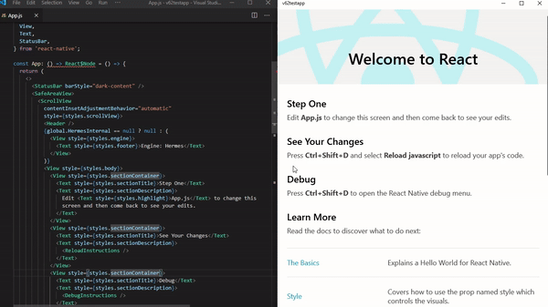
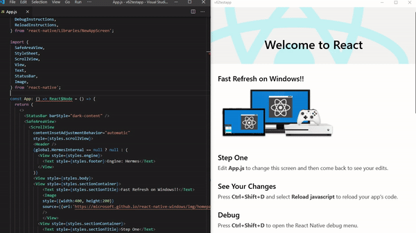

React Native for Windows released latest stable [0.62.2](https://www.npmjs.com/package/react-native-windows/v/0.62.2) with Fast Refresh, RTL support, RedBox and thread safe property storage APIs.

Aligning with our [releases strategy](https://microsoft.github.io/react-native-windows/docs/releases), we are happy to announce the general availability of stable latest [0.62.2 version](https://www.npmjs.com/package/react-native-windows/v/0.62.2) of React Native for Windows. You can try it out using our [Getting Started Instructions](https://microsoft.github.io/react-native-windows/docs/getting-started). Take a look at the [release notes](https://github.com/microsoft/react-native-windows/releases/tag/react-native-windows_v0.62.0) for highlights and breaking changes, more details below. A corresponding update for React Native for macOS is in progress.

## Fast Refresh

Fast Refresh is a great developer productivity feature introduced in React Native in 0.61 as a new and improved version of "hot reloading" and "live reloading". Read more about this : [Fast Refresh in React Native](https://reactnative.dev/docs/fast-refresh). With 0.62, we have brought Fast Refresh to React Native for Windows:

## Microsoft.ReactNative APIs

Several updates have been made to provide thread safe, higher performance instance management on React Native for Windows through new Microsoft.ReactNative APIs. The deprecated ReactUwp framework is no longer supported with 0.62. Read our documentation on these for more, few highlights:

- [ReactApplication](https://microsoft.github.io/react-native-windows/docs/reactapplication-api) : Base Application class for use in applications that are entirely written in react-native
- [ReactNativeHost](https://microsoft.github.io/react-native-windows/docs/reactnativehost-api) : Entry point to create a new react-native instance
- [ReactInstanceSettings](https://microsoft.github.io/react-native-windows/docs/reactinstancesettings-api) : Provides configuration of the react-native instance
- [ReactContext](https://microsoft.github.io/react-native-windows/docs/ireactcontext-api) : Given to native modules to communicate with other native modules, views, application, and the react-native instance
- [ReactPropertyBag](https://microsoft.github.io/react-native-windows/docs/ireactpropertybag-api) : Provides a thread-safe property storage
- [XamlUIService](https://microsoft.github.io/react-native-windows/docs/xamluiservice-api) : Provides access to XAML UI specific functionality. See [Native UI components](https://microsoft.github.io/react-native-windows/docs/view-managers) for more details on the changes to `ViewManager` APIs.
- [RedBoxHandler](https://microsoft.github.io/react-native-windows/docs/iredboxhandler-api) : Provides an extension point to allow custom error handling within the react-native instance

## Alignment with core

As part of our ongoing alignment with React Native core we have added Windows support for several new APIs introduced in ReactNative 0.62. Few callouts here:

- [Appearance](https://reactnative.dev/docs/appearance) module is now supported on Windows. You can use this module to get information on the user's dark/light theme preferences and apply the right styling as needed. Windows previously had `AppTheme` APIs that are now deprecated in favor of aligning with React Native core.
- [focusable](https://reactnative.dev/docs/view#focusable) prop is now supported on `View` and `TextInput`. You can use this prop to indicate whether a component can be focusable (participate in tab order) when navigating with keyboard. Windows previously had an `acceptsKeyboardFocus` prop that is now deprecated in favor of aligning with React Native core.
- **RTL Support in Windows** : Windows now supports `forceRTL` and `allowRTL` modules. Auto-detect and applying RTL when app is running in RTL locale is in progress.

## WinUI 3

The Windows UI Library ([WinUI](https://microsoft.github.io/microsoft-ui-xaml/)) is the native user experience (UX) framework for both Windows Desktop and UWP applications. WinUI is the path forward for all native Windows apps. React Native for Windows is layered on top of WinUI.

[WinUI 3](https://docs.microsoft.com/en-us/windows/apps/winui/winui3/) is the next version of WinUI, completely decoupled from the [Windows 10 SDK](https://developer.microsoft.com/en-us/windows/downloads/windows-10-sdk/) to enable faster shipping of UI features, more backward compatability and to simplify building of version adaptive apps. We are working in close alignment to add WinUI 3 support for React Native for Windows in order to ensure we are always tracking against the latest in native Windows platform. If you are curious, you can try out an experimental preview of this work using the optional flag `--useWinUI3` when running `react-native-windows-init`. You can read more about this effort [here](https://microsoft.github.io/react-native-windows/docs/winui3).

## Coming up next

We will continue to keep up with React Native core versions: 0.63 upgrade for Windows is ongoing with a planned preview for August 2020. In addition, several updates are coming up for React Native for Windows core including support for [automatic linking of community modules](https://reactnative.dev/docs/linking-libraries-ios#automatic-linking) and [LogBox support](https://reactnative.dev/docs/debugging#logbox).

We are also continuing to add Windows support to key community modules, ongoing work includes [react-navigation](https://github.com/react-navigation/react-navigation), [react-native-slider](https://github.com/react-native-community/react-native-slider), [react-native-progressview](https://github.com/react-native-community/progress-view) and several others.

---

If you’re interested in getting started with React Native for Windows, check out our website at [aka.ms/reactnative](https://aka.ms/reactnative).

You can also follow us on Twitter [@ReactNativeMSFT](https://twitter.com/reactnativemsft) to keep up to date on news, feature roadmaps, and more.
