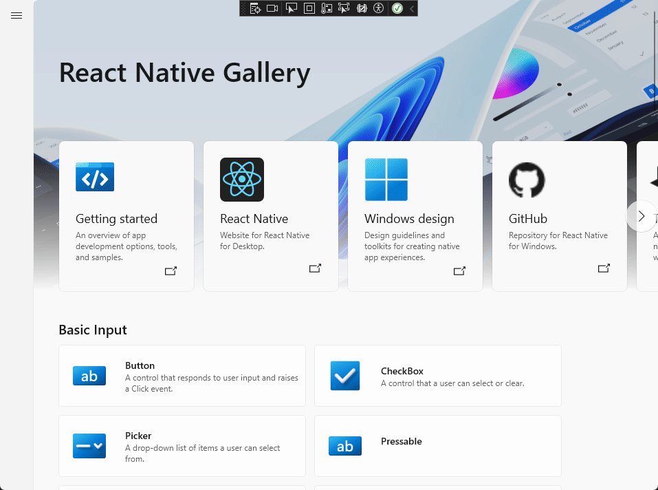
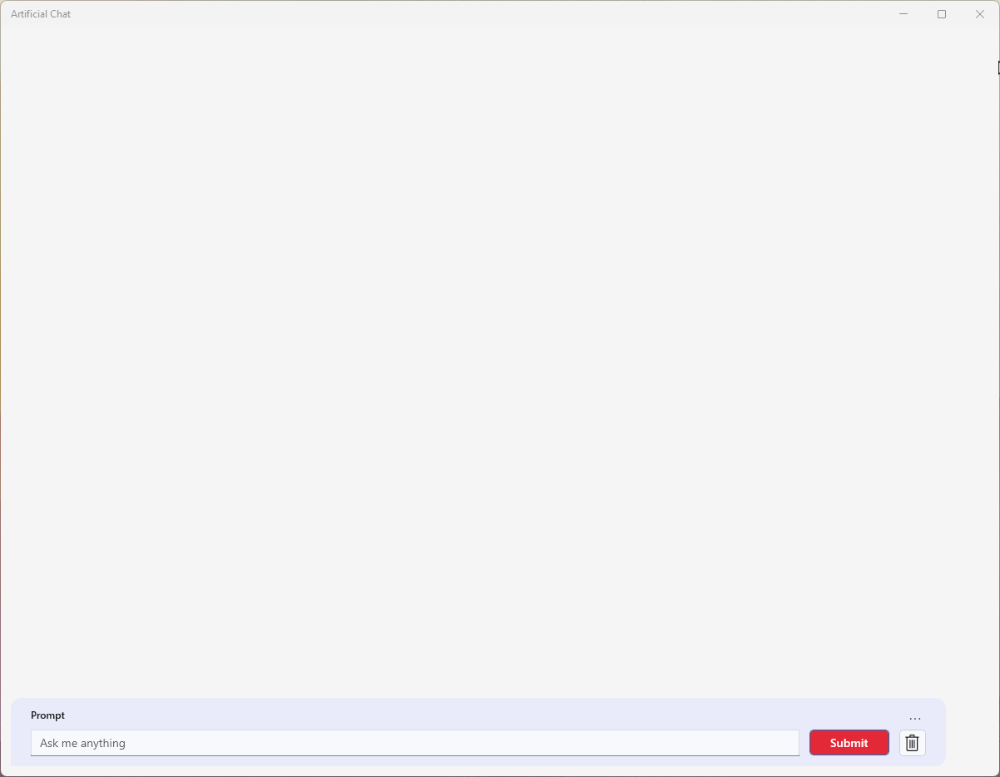
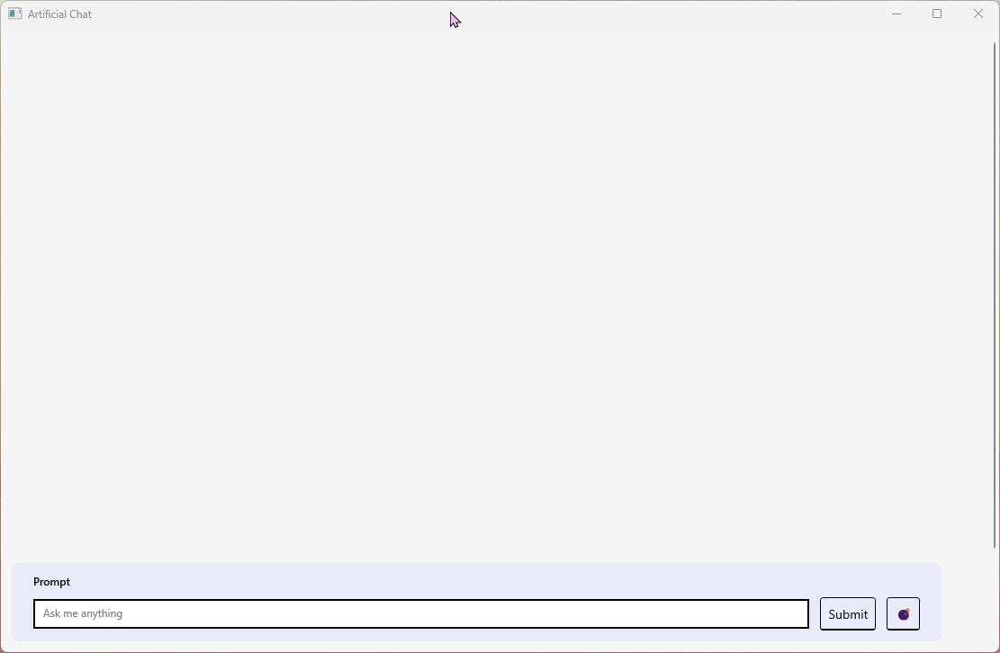

React Native Windows 0.74 is now live, introducing a host of enhancements, from empowered view managers to streamlined template support, learn how you can support more complex React Native Window Applications! Step into the future with our revamped Gallery app, aligned with the WinUI3 gallery for a cutting-edge RNW experience with an expanded example matrix. Plus, get an exclusive peek at Fabric, our latest rendering system for React Native, designed for optimal efficiency in C++. Explore these changes and more!

# 🎉 React Native Windows 0.74 Release Now Available! 🎉

We're thrilled to announce the release of [React Native Windows version 0.74](https://github.com/microsoft/react-native-windows/releases/tag/react-native-windows_v0.74.0), freshly rolled out on 4/29/2024! Alongside the enhancements brought by [React Native 0.74](https://reactnative.dev/blog/2024/04/22/release-0.74), we've been hard at work implementing some exciting Windows-specific updates.

## What's the best way to upgrade my App?

The best way to upgrade to the latest **0.74** release is to follow our [upgrade documentation](https://microsoft.github.io/react-native-windows/docs/upgrade-app) where you can either upgrade with CLI commands or manually update your application using the [Upgrade Helper](https://react-native-community.github.io/upgrade-helper/). 

To get the full list of release details, including breaking changes, check out our [release notes over on our repo.](https://github.com/microsoft/react-native-windows/releases/tag/react-native-windows_v0.74.0)

## New Features

### View Managers Empowered to Capture Pointers 🖱️ https://github.com/microsoft/react-native-windows/pull/8969

Now, view managers can control of the pointer with the new 'AllowUncaptured' flag. This feature enables continued receipt of events, such as PointerMoved, even after the initial press. Say hello to more sophisticated interactions, like dragging elements beyond their conventional boundaries. [Learn more...](https://github.com/microsoft/react-native-windows/pull/8969)

### Streamlined C++ Template Support for create-react-native-library 

Introducing a fresh template, seamlessly integrating with the 'npx create-react-native-library' command. Say goodbye to complexities; now adding Windows support for turbo modules is a breeze. [Learn more...](https://github.com/microsoft/react-native-windows/pull/12481)

### React Native Windows Upgraded to C++20  

With React Native Windows now adopting the latest C++20 standard, we're bringing our codebase up to speed with modern development practices. [Learn more...](https://github.com/microsoft/react-native-windows/pull/12656)

### Enable custom timer factory implementation 

Introducing `Microsoft.ReactNative.ReactCoreInjection.SetTimerFactory`, a game-changer for custom timer implementations in React Native for Windows. Ideal for environments lacking a `Microsoft.UI.Dispatching.DispatcherQueue`, this feature ensures seamless operation, even under diverse circumstances. [Learn more...](https://github.com/microsoft/react-native-windows/pull/12856)

### Enhanced Pressable Component with Disabled Property Support

In response to community feedback, we've bolstered the Pressable component's functionality. This update introduces native support for the `disabled` property, while also ensuring that the onKeyDown event handler behaves appropriately when the component is disabled. [Learn more...](https://github.com/microsoft/react-native-windows/pull/12799)

## Deprecations

### Direct Debugging as the Default

To streamline our debugging process, we're shifting our focus from web debugging to align with React Native's decision to [deprecate web debugging](https://github.com/react-native-community/discussions-and-proposals/discussions/734). For all engines except Hermes, we recommend utilizing direct debugging. While Hermes currently experiences challenges with direct debugging, rest assured, we're actively working on a solution for an upcoming patch release. Check for updates surrounding Hermes [here](https://github.com/microsoft/react-native-windows/issues/12982)

### CoreApp APIs and prototypes

CoreApp was created as a testing ground to explore potential directions for Fabric. We've taken what we've learned as influence on the Fabric app templates and we've made the decision to deprecate the CoreApp option for Paper apps.

## Reliability Boost

While perhaps less flashy, another crucial aspect of 0.74 is our commitment to enhancing the reliability and trustworthiness of React Native Windows. In this release, we've tackled numerous bugs, ranging from resolving [ScrollView's momentum scroll](https://github.com/microsoft/react-native-windows/commit/1367b74599cc888082d280d728b1ac02917cea96) issues and [preventing memory leaks from HTTP responses](https://github.com/microsoft/react-native-windows/commit/ea58fe084c5d8a9116c69807ca9473aaa9e54221) to addressing [UIScheduler deadlocking during shutdown](https://github.com/microsoft/react-native-windows/commit/e2bf3e27f1ad328bcc74d00083482ed5d74a4af6).

If you encounter any bugs in 0.74, please help us out by filing an issue on our [repository](https://github.com/microsoft/react-native-windows/issues)!

# ✨ Improved Gallery App

We've been hard at work revitalizing our Gallery app, aligning it with the [WinUI3 gallery](https://www.microsoft.com/store/productId/9P3JFPWWDZRC?ocid=pdpshare) to showcase a more sleek and modern RNW application. In addition, we've ensured it meets inclusive and accessible design requirements and broadened the array of examples to encompass more community modules and common scenarios.

Get React Native Gallery from the [Microsoft store](https://www.microsoft.com/store/productId/9NPG0B292H4R?ocid=pdpshare) or get the latest changes from our (Github repository)[https://github.com/microsoft/react-native-gallery]!

# 🗺️ Roadmap to Fabric

We've committed ourselves to adding Windows support for React Native's [Fabric](https://reactnative.dev/architecture/fabric-renderer) architecture, the latest rendering system for React Native. Designed for efficiency across platforms in C++, React Native for Windows Fabric seamlessly targets Composition while allowing hosting XAML islands within. Fabric-powered apps default to [WinAppSDK](https://learn.microsoft.com/en-us/windows/apps/windows-app-sdk/) architecture, aligning with modern [WinUI3 standards](https://learn.microsoft.com/en-us/windows/apps/winui/winui3/). Stay tuned for migration guidance for current UWP RNW apps. Follow our journey to Fabric [here](https://github.com/microsoft/react-native-windows/issues/12042).

While our migration efforts to Fabric are underway, our applications aren't quite ready for publication just yet. But fear not! We're thrilled to offer you a sneak peek at a functional app in both Paper and Fabric versions. Please bear in mind that Fabric may exhibit some visual disparities that we are working to iron out.

## Increasing Core Functionality

We have been hard at work getting component parity up to speed with the old architecture's (*commonly referred to as Paper*) rendering system, ensuring a seamless transition for users migrating to Fabric in the future. Several components, including Views, TextInput, and ActivityIndicator, already support a large set of properties and methods, with more components in the work. Here's a current snapshot of our progress:

| Priority | Component | Available | Properties |
| --- | --- | --- | --- | 
| 0 | View| ✅ | 90% | 
| 0 | Text| ✅ | 85% | 
| 0 | Image| ✅ | 89% | 
| 0 | TextInput| ✅ | 80% | 
| 1 | ScrollView| ✅ | 84% | 
| 1 | Modal| 🟥 | 64% | 
| 2 | ActivityIndicator| ✅ | 86% | 
| 2 | Switch| ✅ | 90% | 
| 2 | RefreshControl| 🟥 | 28% | 
*As of February 2024*

## What Lies Ahead

We're currently striving to achieve component parity with the old architecture, ensuring each component has well-rounded functionality and implementing Modal and RefreshControl. Additionally, our efforts extend to migrating community modules to Fabric and exploring the integration of XAML components within a Fabric app.

At this time, Fabric on Windows isn't quite ready for widespread adoption. While we're actively working to enhance both functionality and the developer experience, there are still significant gaps to address.  Keep in mind that documentation may be limited, and we recommend reviewing the provided lists of yet-to-be-implemented features before submitting any bug reports. Rest assured, as we continue our journey, support for Fabric will steadily expand which you can follow [here](https://github.com/microsoft/react-native-windows/issues/12042)!

---

If you’re interested in getting started with React Native for Windows, check out our website at [aka.ms/reactnative](https://microsoft.github.io/react-native-windows/).

You can also follow us on Twitter [@ReactNativeMSFT](https://twitter.com/reactnativemsft) to keep up to date on news, feature roadmaps, and more.
