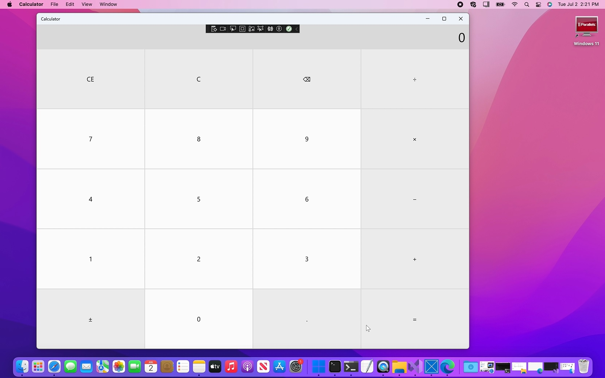
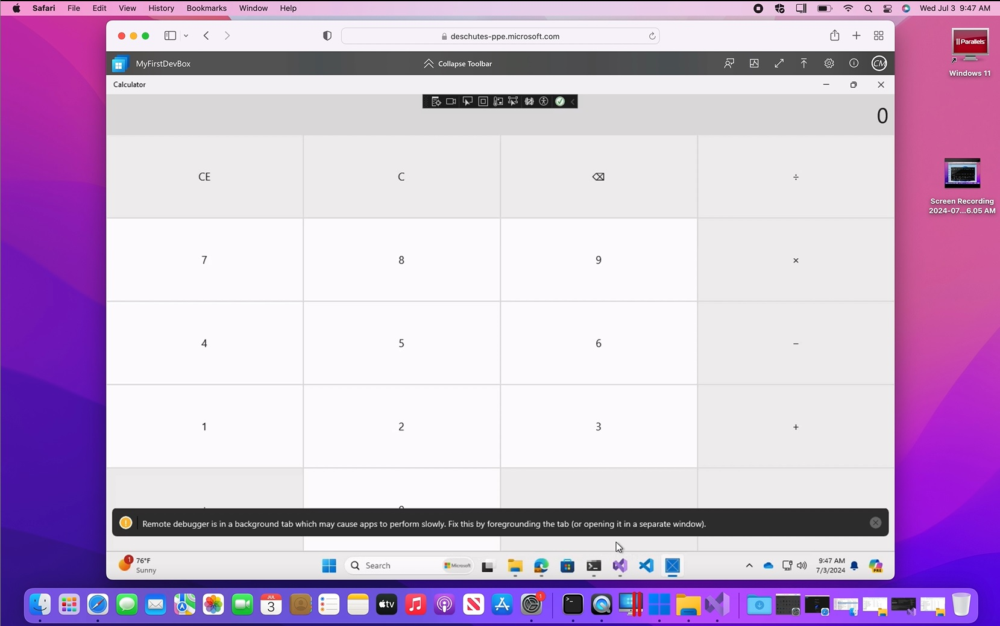

Last year, I gave a talk at the Chain React conference ["Building for Microsoft: Stories from React Native Windows Maintainers"](https://www.youtube.com/watch?v=kMJNEFHj8b8&t=13s&pp=ygUeY2hhaW4gcmVhY3QgMjAyMyBjaGlhcmEgbW9vbmV5) where I spoke about the recent work Microsoft had done with the React Native for Desktop platform, and how Microsoft leverages React Native within key products such as Office and within the Windows OS.

After the talk, I had lots of discussions with developers at the conference. In many of the conversations, one comment rang especially clearly: _*"React Native for Windows sounds great! I'd love to give it a try on my product… but I use a Mac as my development device."*_ Many developers were excited by React Native for Windows, but thought they were unable to give the platform a try because they used a Mac as their development machine and didn't have access to a Windows device.

The React Native for Windows team has heard the community feedback. While running on a Windows device will be the best experience for developing on Windows, we recognize that not everyone involved in a development team can have access to multiple devices to develop for different operating systems. We also see that Macs are used widely within the React Native developer community.

**Owning a Windows PC is not a requirement to build and ship Windows experiences using React Native for Windows.** In this blog post, I'm going to walk through a few options for how to develop React Native for Windows applications from your MacBook using several virtual machine options.

You have several options to spin-up a Windows VM from a Mac including [Parallels](https://www.parallels.com/), [VirtualBox](https://www.virtualbox.org/), [VMWare](https://www.vmware.com/), and [Microsoft Dev Box](https://azure.microsoft.com/products/dev-box/) to name a few. In this post, I'll walk through my experience using Parallels and Microsoft Dev Box to build React Native for Windows applications from a MacBook.

## Creating a Windows VM using Parallels

One option to create VMs on macOS is [Parallels](https://www.parallels.com/), which is software that can be locally installed and supports virtualizing a variety of operating systems including Windows 11.

After signing up for the [Parallels free trial](https://www.parallels.com/products/desktop/trial/), you will be given a download of the Parallels Desktop software and installation instructions. After installing and running Parallels, you will be prompted to install Windows 11. From there,you will be prompted to supply a Windows License Key, which can be purchased from the Microsoft Store. From there, your Windows VM is ready to be run.

With my virtual machine running, I was able to use the VM as if I was on a Windows computer. From here, I could follow the ["System Requirements"](https://microsoft.github.io/react-native-windows/docs/rnw-dependencies) and ["Getting Started"](https://microsoft.github.io/react-native-windows/docs/getting-started) documentation for React Native for Windows. Parallels had access to my local files, so I did not need to redownload any source code to get started developing. When I was finished with my development session, I was able to close the virtual machine and the machine's state was saved for next time.

## Takeaways about Parallels

Windows VMs via Parallels allowed me to quickly (in less than an hour!) experiment with adding Windows support to my existing React Native app.

## Creating a Windows VM using Microsoft Dev Box

The second Windows VM option I tried was [Microsoft Dev Box](https://azure.microsoft.com/products/dev-box/). Microsoft Dev Box is a [Microsoft Azure](https://azure.microsoft.com) product that allows developers to spin up a Windows VM from most modern computers including macOS devices.

Microsoft Dev Box supports:

1. Cloud-based virtual desktop infrastructure.
1. Project-based dev box configurations which allow for code repositories and tools for your current task to be preinstalled.
1. Region-specific dev boxes to help ensure that dev team members have a high-fidelity experience anywhere in the world.
1. Secured cloud workstations via Microsoft Intune.

Before you get started creating a VM with Microsoft Dev Box, there are a couple troubleshooting callouts I want to mention:

1. You will need an Azure subscription that is not the ["free trial"](https://azure.microsoft.com/free/) subscription. You must upgrade to the ["Pay As You Go"](https://azure.microsoft.com/pricing/purchase-options/pay-as-you-go/) subscription to use Microsoft Dev Box, but you can use the $200 of free credits that you gained via the "free trial" subscription as initial payment within the “Pay As You Go” plan. If you try to create a Dev Box Definition with the "free trial" Azure subscription, you will receive a "Quota has been reached" error.
1. You will also need a work or school Microsoft Account (MSA). Personal or guest MSAs cannot be used with the Dev Box portal at this time.
1. Your machine will need to be managed with [Microsoft Intune](https://www.microsoft.com/security/business/Microsoft-Intune).

I followed Microsoft's documentation to create a dev box using Microsoft Dev Box. I found the documentation to be straightforward to follow, and there are also several tutorial videos online from developers if you prefer to see someone walk through the steps live. You'll need to complete two steps to get your dev box up and running: [Setting Up Your Dev Box Service](https://learn.microsoft.com/azure/dev-box/quickstart-configure-dev-box-service) and [Creating a Dev Box](https://learn.microsoft.com/azure/dev-box/quickstart-create-dev-box). These steps should take about an hour to complete.

Once your dev box is running, you will be able to use the virtual machine as if you are on a Windows computer.

Same as with Parallels above, you can follow the ["System Requirements"](https://microsoft.github.io/react-native-windows/docs/rnw-dependencies) and ["Getting Started"](https://microsoft.github.io/react-native-windows/docs/getting-started) documentation for React Native for Windows to get set up.

Unlike Parallels, dev box runs in a cloud and does not have access to your local files, so you will need to redownload any source code that you need to get started developing. When you are finished with your development session and have shut down the virtual machine in the Dev Box portal, your machine's state will be saved for next time.

## Takeaways about Microsoft Dev Box

Microsoft Dev Box is a great tool when your team is ready for a larger level of investment in the Windows platform. Its feature offerings of cloud-based infrastructure, pre-configured dev boxes, and Intune secured workstations are great for enterprise-scale development.

Microsoft Dev Box requires several [admin and configuration steps](https://learn.microsoft.com/azure/dev-box/quickstart-configure-dev-box-service) to get started, so if you're looking to quickly experiment with RNW within a VM, Parallels or another virtual machine offering may be a good option to get started with. Then once you're ready to scale your Windows VM usage across many developers to build large production experiences, Microsoft Dev Box could become a better option.

## Overall Takeaways

In this post, I looked at two options for building React Native for Windows apps from Mac devices using Windows VMs. Below is a table which captures the scenario comparisons between Microsoft Dev Box and Parallels.

| Feature                                          | Microsoft Dev Box | Parallels |
| ------------------------------------------------ | ----------------- | --------- |
| Locally installed virtual machine software       |                   | ✅        |
| Cloud-based virtual machine                      | ✅                |           |
| Easy to follow documentation                     | ✅                | ✅        |
| Great for quick experimentation with Windows     |                   | ✅        |
| Great for enterprise development                 | ✅                |           |
| Scale Windows VM usage across several developers | ✅                |           |
| Pre-configured dev boxes                         | ✅                |           |

I want to callout that, when your company is ready to invest in supporting Windows, having dedicated Windows hardware will be best developer experience.

As you reach the end of reading, I encourage you to give React Native for Windows and Windows VMs a try! To get started with React Native for Windows visit [aka.ms/reactnative](https://microsoft.github.io/react-native-windows/). If you have any feedback or questions for the React Native for Windows team, you can reach out to us on GitHub at [microsoft/react-native-windows](https://github.com/microsoft/react-native-windows). We want to hear about your developer experience!

---

You can also follow us on X [@ReactNativeMSFT](https://x.com/reactnativemsft) to keep up to date on news, feature roadmaps, and more.
