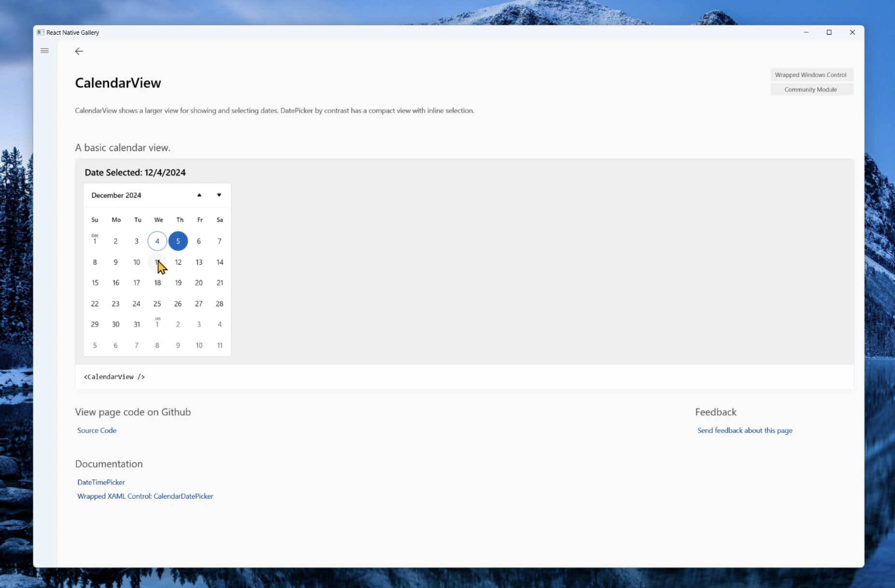

For years, Windows developers have been asking the Microsoft client platform team "What platforms does Office use to build their applications? Does Microsoft use the same tech internally that they espouse externally?" This article is focused on answering that exact customer question. I'll talk about one of the approaches Office has taken to modernize their UI. Through leveraging modern app platforms like Windows App SDK and React Native, Office has successfully delivered rich experiences to 600 million users, improved app reliability, and upgraded their developer experience. I’ll also cover how you can use these same techniques in your Windows apps today.

# Windows App Ecosystem
If you aren’t familiar with the Windows App Ecosystem, here’s a refresher. The Windows App Ecosystem describes the system of platforms, libraries, and frameworks that are used to build modern Windows apps. At the bottom layer of the ecosystem is the computer itself, which consists of drivers and hardware. Above this layer is the Windows Platform SDK which is determined by the version of the Windows OS installed on the computer. Next is Windows App SDK which provides APIs that are determined by the version of your Windows application. You then have any additional Nuget packages, libraries, or other applications that your app might need. Finally, at the top is the Windows application itself. Apps built in the Windows App Ecosystem may use capabilities exposed at each layer.

## Windows App SDK
The [Windows App SDK](https://learn.microsoft.com/windows/apps/windows-app-sdk/) (WinAppSDK) lifts the modern app stack into your specific application and creates its own virtualized instance. If you want to call newer APIs, your app can use a newer WinAppSDK version. All the Microsoft.* APIs are part of the WinAppSDK. In contrast, the Windows.* APIs are part of the Platform SDK installed on a Windows machine. This means that apps using the Platform SDK must keep in mind which versions of Windows their app ships to.

WinAppSDK was designed to enable modern apps to incrementally adopt newer functionality in piecemeal updates. WinAppSDK also prioritizes predictable consistency to provide the latest Windows app functionality everywhere, which helps apps run on Windows versions all the way down to Windows 10 RS5 and Server 2019 without requiring any OS servicing or IT admin updates. WinAppSDK also allows developers to choose when to pick up a new update. In short, WinAppSDK enables you to gradually adopt new features and maintain consistent app performance across various Windows versions.

## How does Microsoft support desktop development?
Whether you are building native apps, web apps, or hybrid apps, Microsoft is committed to ensuring you’re successful. Each of these solutions specializes in different types of applications. For example, WinUI and WPF are Microsoft's pure native UI platforms. [WinUI](https://learn.microsoft.com/windows/apps/winui/) is used to build Windows itself; it's optimized for our modern hardware and is the fullest expression of the Windows experience. WinUI applications can be written in C++ or C#. On the other hand, [WPF](https://learn.microsoft.com/dotnet/desktop/wpf/overview/?view=netdesktop-9.0) is an industry-proved framework that has a rich ecosystem written in C#.

While WinUI and WPF are great platform choices for C++ and C# developers, Microsoft is also invested in supporting JavaScript developers building apps on Windows. For JS developers who want fully native apps, [React Native for Windows](https://learn.microsoft.com/windows/dev-environment/javascript/react-native-for-windows/) is a great option that allows developers to use JS/React skills and tools to develop native cross-plat applications that target desktop, mobile, web, and more. React Native is built on top of Windows App SDK, so developers building apps with React Native still have access to WinUI controls and other key APIs that ship within Windows App SDK. 

Whatever type of app you have, the platforms are built to work together. For example, React Native uses WinUI under the covers to support many native Windows controls. Below is a screenshot of the React Native Gallery app. [React Native Gallery](https://apps.microsoft.com/detail/9npg0b292h4r?hl=en-us&gl=US) is a React Native application that showcases the current set of supported controls for the platform. In the screenshot, you can see a WinUI3 CalendarView control being hosted within the React Native application. The control seamlessly integrates into the app's UI and has the same look and feel as it would running in a WinUI3 application. Above the CalendarView, a React Native Text component displays the currently selected date in the calendar. Not only can WinUI and React Native content be rendered side by side, app data can flow between the platforms. 

# Modernizing Office
There’s a variety of reasons why Office wants to modernize, but the cost of rewriting an entire app would be very expensive. Instead, Office incrementally adopts new UI frameworks for some experiences while leaving others on legacy frameworks. Over the years, Office has integrated several UI frameworks based on specific goals and platform features. In addition to their internal UI, Office uses React Native, WebView2, and Scene Graph. As mentioned above, these client platforms were designed to work together, which is critical for apps like Office that rely on framework interoperability. 

## Office using React Native
Let's first talk about why Office chose to use React Native. Office has hundreds of millions of customers who expect visual consistency across desktop, mobile, and web. Currently, there are over 40 Office experiences which use React Native to build cross-platform features such as Privacy Dialog and Accessibility Assistant. 

### Leverage Web Skills
Office uses React to build the web versions of their app suite, giving the team extensive experience with web technologies and JavaScript. By using React Native for new desktop features, Office developers can leverage their JavaScript skills and source code to transition these experiences from web to desktop, enabling faster shipping.

### Cross-platform Support
For Office, one of React Native's highlights is its support for building cross-platform experiences. Cross-platform technologies allow Office to quickly ship experiences everywhere through code sharing. React Native lets developers write app source code in JavaScript and create native cross-platform applications that look consistent with the OS they’re running on.

### Content Islands
React Native can be embedded into existing Windows applications, which allows apps to choose which experiences to migrate onto the platform. This feature is critical for Office’s modernization efforts. React Native content islands seamlessly integrate into an app's overall UI giving a consistent look and feel across an application. The islands can interact with one another and pass app data between platforms.

Office's new Copilot experience between the Ribbon and document canvas is built using React Native. In the screenshot below, you can see the UI React Native provides feels consistent with the rest of the app. This feature is a great showcase of how Office can incrementally adopt newer UI frameworks like React Native. 

## Office using Windows App SDK
Let's now talk about why Office is choosing to use Windows App SDK. Office needs to run on all currently supported Windows devices. Historically, they've relied on Windows Platform SDK for accessing Direct3D, Composition, and Input to render documents at high fidelity with inking and touch support. However, to support multiple versions of Windows, they've had to fork their code. In using Windows App SDK, Office developers can write code once and continue supporting multiple versions of the Windows operating system. 

### Consistent Releases
Like other large apps Office needs their dependencies to have a predictable schedule. WinAppSDK's "significant releases" update twice a year, which is where most new features come in. These are 1.6, 1.7, etc., and they align to the Spring and Fall timeline. WinAppSDK's "update releases" are the dot releases which ship every month. WinAppSDK’s structured release schedule grows Office’s confidence in taking dependency on WinAppSDK.

WinAppSDK was designed to give large apps the ability to upgrade to new versions quickly. To ensure compatibility with the version of WinAppSDK an app has tested against, WinAppSDK also supports specifying which "update version" an app should use. This allows apps like Office to gradually migrate their app suite to a new minor version of WinAppSDK.

### Installation Flexibility
WinAppSDK wants to support installation flexibility for large apps like Office. There are currently two ways to ship WinAppSDK: "self-contained" and "framework packages". With the "self-contained" option, apps only ship the components of WinAppSDK that they use. This can be great if you are only planning to use a few components of WinAppSDK, but it will increase your app's distribution size. With the "framework packages" option, your app installs a common package like the VC Runtime. The install is then shared by all apps using the same "significant release" of WinAppSDK. With these two options, Office has the choice to adjust their WinAppSDK installation to fit their app’s needs best.

### Using ARM64EC
Another key factor for Office is ensuring excellent performance on the new ARM64 [Copilot+ PCs](https://learn.microsoft.com/windows/ai/npu-devices/) while also supporting their extensive x64-based 3rd-party extensibility ecosystem. To support this, Windows added a new feature to Windows 11 called ARM64EC (Emulation Compatible). It enables processes to load both ARM64EC and x64 code at the same time. It's different than ARM64 Classic, which is still supported for apps running on Windows 10. WinAppSDK 1.7 will start introducing ARM64EC support.

### Agile and High Reliability 
Office uses A/B development techniques to ensure their app suite provides a reliable user experience. WinAppSDK provides the option to A/B test version upgrades. When upgrading between WinAppSDK "significant releases", Office can deploy both older and newer versions of WinAppSDK and then decide at runtime which to load. This technique ensures Office can maintain high reliability while updating.

# Summary
This article walked through how Office modernized their app suite using Windows App SDK and React Native. React Native enabled Office to develop new features quickly through embedding islands of React Native content into their existing app suite. These cross-platform experiences were built with JavaScript allowing code sharing across mobile, desktop, and web. Windows App SDK enabled Office to continue to leverage the power of Windows at a lower maintenance cost and with higher reliability. 

Checkout our talk from Microsoft Ignite 2024, [_BK304 – Modernize your app by learning how Office leverages Windows App SDK_](https://ignite.microsoft.com/sessions/BRK304), if you’d like to learn more on this topic and see live demos of React Native, WinAppSDK, and Office.

You can learn more about React Native or WinAppSDK at the links below: 

Learn more about [Windows App SDK](https://learn.microsoft.com/windows/apps/windows-app-sdk/).

Learn more about [React Native](https://learn.microsoft.com/windows/dev-environment/javascript/react-native-for-windows/).

Learn more about [Windows development](aka.ms/windev).

---

If you’re interested in getting started with React Native for Windows, check out our website at [aka.ms/reactnative](https://microsoft.github.io/react-native-windows/).

You can also follow us on X [@ReactNativeMSFT](https://twitter.com/reactnativemsft) to keep up to date on news, feature roadmaps, and more.